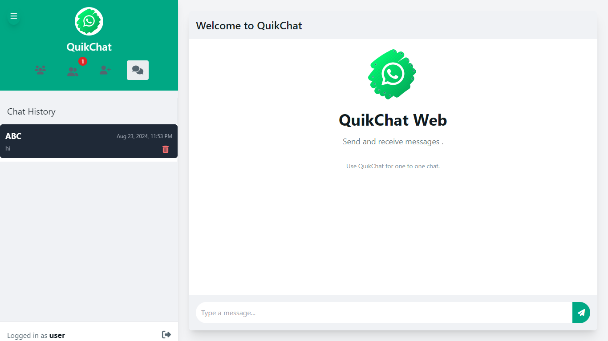

# Spring Chat App 🗨️ 

A simple real-time chat application built with Spring Boot and WebSocket, featuring user authentication, friend management, and chat history.

## Table of Contents
- [Features](#features)
- [Screenshots](#screenshots)
- [Tech Stack](#tech-stack)
- [Installation](#installation)
- [Usage](#usage)
- [Contributing](#contributing)
- [License](#license)
- [Contact](#contact)

## Features
- **Real-time Messaging:** Instant messaging between users using WebSocket.
- **User Authentication:** Secure login and registration with Spring Security.
- **Friend Management:** Add friends, view friend requests, and manage friend lists.
- **Chat History:** View past conversations with data persistence.
- **Responsive UI:** User-friendly interface built with Thymeleaf and Bootstrap.

## Screenshots
### Chat Window


### Add Friend Window


### Friend List Window


### Friend Requests Window


### Chat History Window


## Tech Stack
- **Backend:** Java 21, Spring Boot 3.3.2, Spring Security, Spring Data JPA, WebSocket
- **Frontend:** Thymeleaf, Bootstrap
- **Database:** MySQL
- **Build Tool:** Maven
- **Other:** Lombok, Docker (optional)

## Installation

### Prerequisites
- **Java 21** installed on your machine. [Download Java](https://www.oracle.com/java/technologies/javase/jdk21-archive-downloads.html)
- **Maven** installed. [Download Maven](https://maven.apache.org/download.cgi)
- **MySQL** Database setup.
- **Git** installed. [Download Git](https://git-scm.com/downloads)

### Steps
1. **Clone the repository:**
    ```bash
    git clone https://github.com/Anpatil1/spring-chat-app.git
    cd spring-chat-app
    ```

2. **Configure the database:**

    Create a MySQL database named `chatapp`.

    Update the `src/main/resources/application.properties` file with your MySQL credentials:

    ```properties
    spring.datasource.url=jdbc:mysql://localhost:3306/chatapp
    spring.datasource.username=your_username
    spring.datasource.password=your_password
    spring.jpa.hibernate.ddl-auto=update
    spring.jpa.show-sql=true
    spring.thymeleaf.cache=false
    ```

3. **Build the project:**
    ```bash
    mvn clean install
    ```

4. **Run the application:**
    ```bash
    mvn spring-boot:run
    ```

5. **Access the application:**

    Open your browser and navigate to `http://localhost:8080`.

## Usage

- Register a new account or login with existing credentials.
- Add friends by searching for their username and sending friend requests.
- Accept or decline friend requests in the Friend Requests window.
- Start chatting in the Chat Window with your friends.
- View chat history in the Chat History window.

## Contributing

Contributions are welcome! Please follow these steps:

```bash
# Fork the repository.
# Create a new branch
git checkout -b feature/YourFeature

# Commit your changes
git commit -m 'Add some feature'

# Push to the branch
git push origin feature/YourFeature

# Open a pull request.
```
## Contact

- **Email**: [nangareavadhut@gmail.com]
- **LinkedIn**: [Avadhut Nangare Patil](https://www.linkedin.com/in/avadhut-nangare-patil-470901250/)
